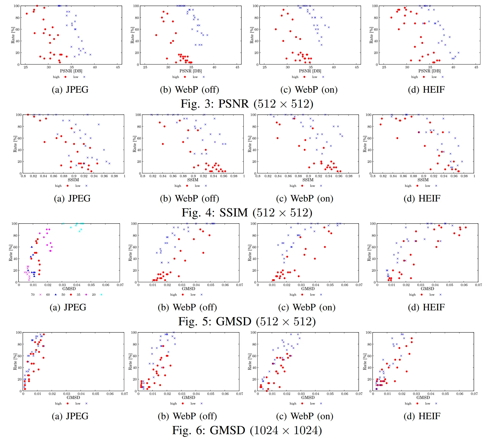

# MIDD: Meikoudai Image Distortion Dataset

Subjective assessment dataset of visually lossless ratio by absolute binary decision (ABD) for IQA of near-lossless compression.

**Dataset type**
* MIDD-GAR (Gray and Resolution, JPEG, WebP, HIEF), QoMEX2023
* MIDD-CAP (Color and Patch, JPEG), submitted 2025.

**Link**
* [Github](https://github.com/norishigefukushima/iqanearlossless)
* [Direct download link (MID-GAR 30.2 MB)](https://drive.google.com/file/d/1aNx2gfoyxqbeaXopFT-bZnX_z071HNi3/view?usp=sharing)
* [Direct download link (MID-CAP 117.2 MB)](https://drive.google.com/file/d/1vLhyBulGK4W4H81FVBYt2ddyN008THhS/view?usp=sharing)

Meikoudai is an abbreviation of Nagoya Institute of Technology in Japanese.

The dataset name MIDD (QoMEX2023) has been renamed to MIDD-GAR due to the addition of a new dataset (MIDD-CAP) (2/7/2025).

## 1. MIDD-GAR (Gray and Resolution, JPEG, WebP, HIEF), QoMEX2023
[1] Soichiro Honda, Yoshihiro Maeda, and Norishige Fukushima,
"Dataset of Subjective Assessment for Visually Near-Lossless Image Coding based on Just Noticeable Difference,"
in Proc. International Conference on Quality of Multimedia Experience (QoMEX), 2023.
[[IEEE Xplore]](https://ieeexplore.ieee.org/document/10178524)
[[pdf]](https://fukushima.web.nitech.ac.jp/paper/2023_qomex_honda.pdf)

```
@INPROCEEDINGS{honda2023dataset,
  author={Honda, Soichiro and Maeda, Yoshihiro and Fukushima, Norishige},
  booktitle={Proceedings of International Conference on Quality of Multimedia Experience (QoMEX)}, 
  title={Dataset of Subjective Assessment for Visually Near-Lossless Image Coding based on Just Noticeable Difference}, 
  year={2023},
  pages={236-239},
  doi={10.1109/QoMEX58391.2023.10178524}
}
```
## 2. MIDD-CAP (Color and Patch, JPEG), submitted 2025.
[2] Soichiro Honda, Yoshihiro Maeda, Osamu Watanabe, and Norishige Fukushima,
"A Multi-Level Patch Dataset for JPEG Image Quality Assessment by Absolute Binary Decision,"
submitted, 2025.

```
@INPROCEEDINGS{honda2023dataset,
  author={Honda, Soichiro and Maeda, Yoshihiro and Watanabe, Osamu and Fukushima, Norishige},
  booktitle={submitted}, 
  title={A Multi-Level Patch Dataset for JPEG Image Quality Assessment by Absolute Binary Decision}, 
  year={2025},
  pages={9 page},
}
```

# Specification for Each Dataset
## 1. MIDD-GAR, QoMEX2023
* Number of pristine images: 10 (high or low-frequency images)
* Resolution: 512x512 (grayscale) for pristine images
* Number of DPI types: 2 (512x512 (1x1), 1024x1024 (2x2))
* Coding types: 4 (JPEG, WebP without DF (off), WebP with DF (on), HEIF)
  * DF: deblocking filter
* Number of distortions (QPs): 5 for each distortion and size
  
|Codec    |Size     |QPs                |
|---------|:-------:|-------------------|  
|JPEG     |  512x512| 70, 60, 50, 35, 20|
|JPEG     |1024x1024| 90, 80, 70, 60, 50|
|WebP(on) |  512x512| 70, 60, 50, 35, 20|
|WebP(on) |1024x1024| 90, 80, 70, 60, 50|
|WebP(off)|  512x512| 70, 60, 50, 35, 20|
|WebP(off)|1024x1024| 90, 80, 70, 60, 50|
|HEIF     |  512x512| 45, 40, 35, 30, 25|
|HEIF     |1024x1024| 55, 50, 45, 40, 35|

* Number of subjects: 30 per distortion image
* Total number of judgments: 10x2x4x5x30=12,000
* Output type: binary decision individual or visually lossless ratio
* Condition: controlled laboratory environment
* Display: EIZO CS 270 (27inch  2560x1440 / IPS)
* Viewing distance: 0.5m
* Protocol type: absolute binary decision (ABD)
  * Showing side-by-side original and distorted images at random from 200 distortion images.
    * no dependency on images, distortion types, or distortion levels.
    * naive test without acceleration: bi-selection, adjustment, etc.
    * dependency for DPI: 512x512 image test and then 1024 x 1024 image test.
  * Subjects have up to 12 seconds for a judgment.
  * The judgment is a binary decision: same or not.
  * Experiment time: 2 hours per subject for 400 images with 3 breaking terms.
 * 
The following are example plots between IQA scores and identification rate, which judge whether distorted images are the same or not.  
0% means all subjects judge distorted and source images are the same (opposite to visually lossless ratio). 




## 2. MIDD-CAP, submitted 2025.
* Number of images: 496image 24, 248patch 48, 124 patch 96 (high or low-frequency images)
* Resolution: 496x496 (color) for pristine images, 248x248 and 124x124 for each patch level
* Number of patch types: 3 (496x496, 248x248p, 124x124p)
* Coding types: 1 (JPEG)
* Number of distortions (QPs): 8 for each distortion and image or patch size
  
|Codec    |images|Size     |QPs                |
|---------|------|:-------:|-------------------|  
|JPEG     |  24  |496x496  | inf, 90, 80, 70, 60, 50, 40, 30, 20|
|JPEG     |  48  |248x248p | inf, 90, 80, 70, 60, 50, 40, 30, 20|
|JPEG     |  96  |124x124p | inf, 90, 80, 70, 60, 50, 40, 30, 20|

* Number of subjects: 30 per distortion image
* Total number of judgments: (24+48+96)x(8+1)x30=45,360: (pristine images/patches) * (QPs) * (subjects)
* Output type: binary decision individual or visually lossless ratio
* Condition: controlled laboratory environment
* Display: EIZO CS 270 (27inch  2560x1440 / IPS)
* Viewing distance: 0.5m
* Protocol type: absolute binary decision (ABD)
  * Display
    * Session 1 Showing 8 * 9=72 side-by-side pristine and distorted images (496x496) at random from 24*9=216 distortion images.
    * Session 2 Showing 8 * 2* 9 = 144 side-by-side pristine and distorted patches (248x248p) at random from 48*9=432 distortion images.
      * Session 3 Showing 8 * 2* 9 = 144 side-by-side pristine and distorted patches (124x124p) at random from 96*9=864 distortion images.
    * Session 4 Showing 8 * 2* 9 = 144 side-by-side pristine and distorted patches (124x124p) at random from 96*9=864 distortion images.  
  * Subjects have up to 12 seconds for a judgment.
  * The judgment is a binary decision: same or not.
  * Experiment time: 2 hours per subject for 504 images with 3 breaking terms.  

 
# Explanation of 1. MIDD-GAR directory structure 
## source image
The 10 source images are contained in the following directory.
```
source_image/kodim(image number).png
```
Source images are losslessly compressed by OptiPNG.

## compression image
The distorted images are contained in the following directory.
```
compression_image/kodim(image number)\_(quality rate)\_(compression metrix).(filename extention)
```

HEIF images are decoded and then lossless compressed by OptiPNG for usability.
JPEG and WebP are their own formats.

## identification\_ratios\_data
The identification ratios between the original and compressed images are listed.
The unit of identification ratio values are %.

* data.xlsx: 512x512
* data200.xlsx: 1024x1024

## data\_per\_participants
The data for each of the 30 participants is listed individually.
The images that participants judged to be the same are marked as "1", and those judged to be different are marked as "0".

* data\_individual.xlsx: 512x512
* data200\_individual.xlsx: 1024x1024

# Explanation of 2. MIDD-CAP directory structure 
## source image
The following directory contains 24 pristine images (496x496), 48 pristine patches (248x248), and 96 pristine patches (124x124).
```
source_image_496/kodak(image_number1-24).png
source_image_248/kodak(image_number1-24)_(patch_number1-2).png
source_image_124/kodak(image_number1-24)_(patch_number1-4).png
```
Pristine source images/patches are losslessly compressed by OptiPNG.

## distortion image
The following directory contains 192 distorted images (496x496), 384 distorted patches (248x248), and 768 pristine patches (124x124).
```
distortion_image_496/kodak(image_number1-24)_(qp20-90).png
distortion_image_248/kodak(image_number1-24)_(patch_number1-2)_(qp20-90).png
distortion_image_124/kodak(image_number1-24)_(patch_number1-4)_(qp20-90).png
```

JPEG-encoded images are decoded and then lossless compressed by OptiPNG for usability.

## data_vlrate
The visually lossless ratio values for each data are stored in CSV format.
The unit of the ratio values are %.
Each csv file (result_496.csv, result_248.csv, result_124.csv) has 1D vector representation.

The order is as follows
```
for image_number=1:24
 for patch_number=1:(1 or 2 or 4)
  for QP = 20:90:10
```
If QP reaches 90, the next patch\_numer index to start from is QP20, and if the patch number reaches MAX, the next image\_number to start from is.

For example, `result_496.csv` are 
```
96.667  (kodak1_20.png)
90      (kodak1_30.png)
70      (kodak1_40.png)
...
```

In the case of  `result_124.csv`,
```
96.667  (kodak1_1_20.png)
90      (kodak1_1_30.png)
90      (kodak1_1_40.png)
...
```

## data\_per\_participants
The data for each of the 30 participants is listed individually.
The images that participants judged to be the same are marked as "1", and those judged to be different are marked as "0".

**under construction**

# Related Project

[GitHub link](https://fukushimalab.github.io/LLF/)

On this page, the results of upsampling using the same protocol and subjective assessment are published.
Rather than simple upsampling, high-resolution guided upsampling such as joint bilateral upsampling is used.
The results of subjective assessment of the approximate processing that accelerates processing speed by guided upsampling of the low-resolution image processed with the high-resolution image before processing.

[3] Teppei Tsubokawa, Hiroshi Tajima, Yoshihiro Maeda, and Norishige Fukushima “Local Look-Up Table Upsampling for Accelerating Image Processing,” Multimedia Tools and Applications, 2023.
